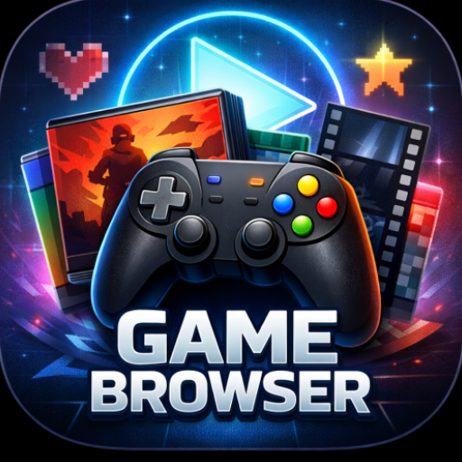
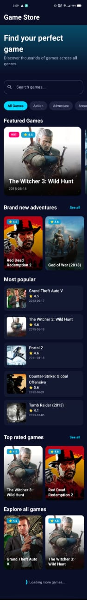
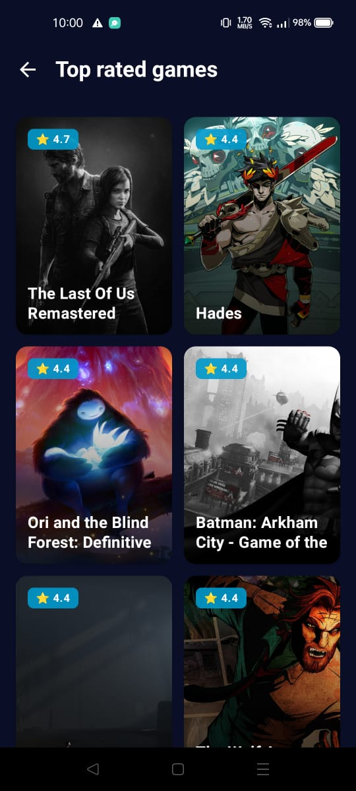
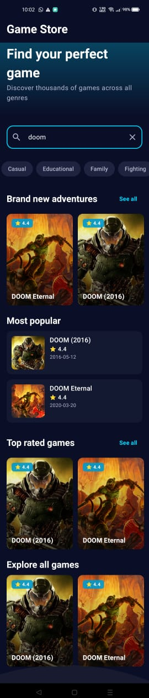
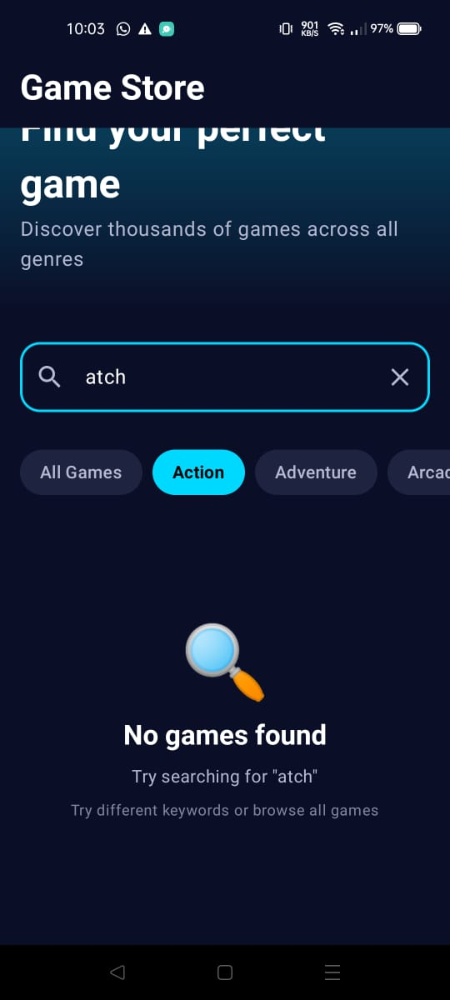
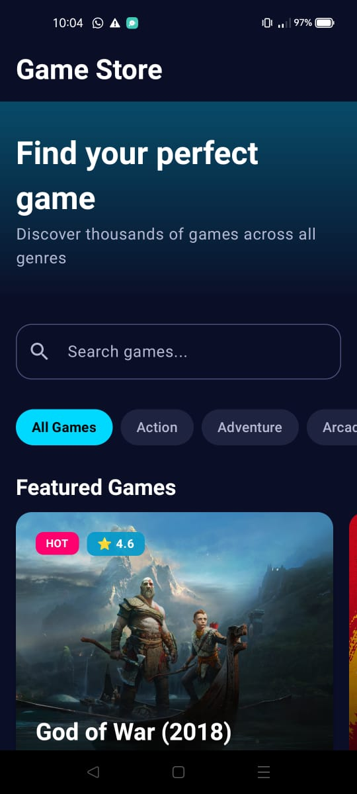
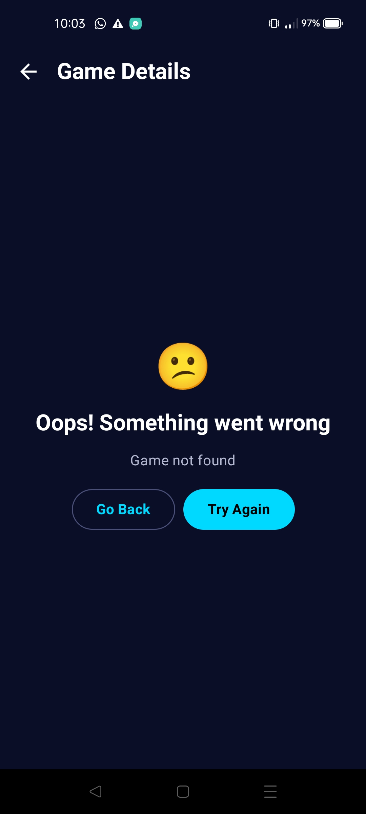
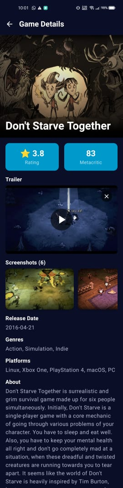
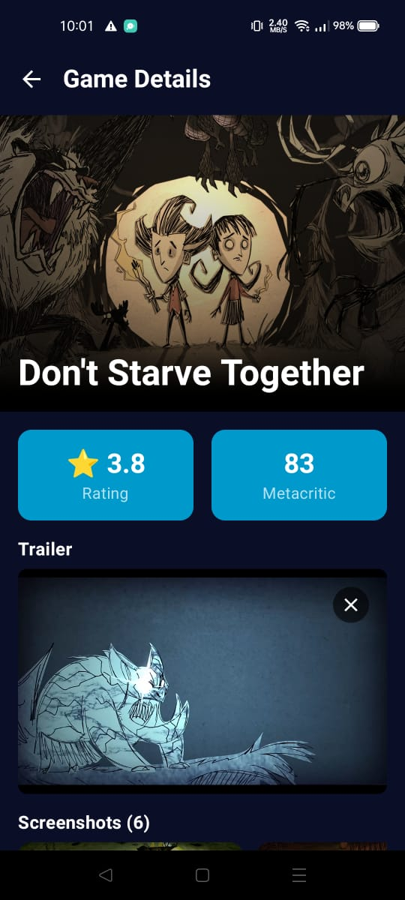

# Game Browser Android App

A modern Android application for browsing video games using the RAWG Video Games Database API. Built with Jetpack Compose and Clean Architecture principles.

<div align="center">
  
 

</div>

## 📱 Screenshots
<table> <tr> <td align="center">  <br /> <sub><b>Home Screen</b></sub> <br /> <sub>Browse featured & popular games</sub> </td> <td align="center">  <br /> <sub><b>See All Games</b></sub> <br /> <sub>Explore full game lists</sub> </td> <td align="center">  <br /> <sub><b>Search & Filter</b></sub> <br /> <sub>Local real-time filtering</sub> </td> </tr> <tr> <td align="center">  <br /> <sub><b>Empty Search State</b></sub> <br /> <sub>No results found handling</sub> </td> <td align="center">  <br /> <sub><b>Offline Mode</b></sub> <br /> <sub>Browse cached games</sub> </td> <td align="center">  <br /> <sub><b>Error State</b></sub> <br /> <sub>Graceful error handling</sub> </td> </tr> <tr> <td align="center">  <br /> <sub><b>Game Details</b></sub> <br /> <sub>Full game information</sub> </td> <td align="center">  <br /> <sub><b>Trailer Available</b></sub> <br /> <sub>Embedded video preview</sub> </td> <td align="center">  <br /> <sub><b>Trailer Playback</b></sub> <br /> <sub>Fullscreen video playback</sub> </td> </tr> </table>

## ✨ Features

### 🎮 Games List Screen
- Browse thousands of video games with infinite scroll pagination
- Filter games by genre (Action, RPG, Strategy, etc.)
- Real-time local search (filters loaded games without API calls)
- Multiple game categories:
  - **Featured Games** (Rating ≥ 4.5)
  - **New Releases** (sorted by release date)
  - **Top Rated** (sorted by rating)
  - **Popular Games**
- Comprehensive state handling (Loading, Error, Empty, Success)
- Pull-to-refresh functionality

### 🎯 Game Details Screen
- Complete game information:
  - Game name and cover image
  - Rating with color-coded display
  - Release date
  - Full description
  - Supported platforms
  - Game genres
  - Metacritic score (when available)
- **Trailer video playback** with fullscreen support
- **Screenshots gallery** with fullscreen viewer
- Smooth navigation and animations

### 💾 Offline Support (Bonus Feature)
- Network-first caching strategy
- Room database for local persistence
- Browse cached games without internet
- Automatic cache synchronization

## 🛠️ Tech Stack

### Core Technologies
- **Language:** Kotlin 100%
- **UI Framework:** Jetpack Compose
- **Design System:** Material Design 3
- **Minimum SDK:** API 30 (Android 11)
- **Target SDK:** API 35 (Android 15)

### Architecture & Patterns
- **Architecture:** MVVM (Model-View-ViewModel) with Clean Architecture
- **Dependency Injection:** Dagger Hilt
- **Asynchronous Programming:** Kotlin Coroutines + Flow
- **Reactive Programming:** StateFlow for UI state management

### Networking & Data
- **HTTP Client:** Retrofit 2 with OkHttp interceptors
- **JSON Parsing:** Gson
- **Image Loading:** Coil for Compose
- **Local Database:** Room SQLite
- **API:** RAWG Video Games Database API

### Testing
- **Unit Testing:** JUnit 4
- **Mocking:** MockK
- **Coroutines Testing:** kotlinx-coroutines-test
- **Test Coverage:** ViewModel layer with 20+ test cases

## 🏗️ Architecture

### Pattern: MVVM with Clean Architecture

**Why MVVM?**
- **Separation of Concerns:** UI logic is separated from business logic
- **Testability:** ViewModels can be unit tested without UI dependencies
- **Lifecycle Awareness:** ViewModels survive configuration changes
- **Reactive UI:** StateFlow enables unidirectional data flow

**Why Clean Architecture?**
- **Independent Layers:** Each layer can be developed and tested independently
- **Flexible:** Easy to swap implementations (e.g., Retrofit → Ktor)
- **Maintainable:** Changes in one layer don't affect others
- **Scalable:** New features can be added without modifying existing code

### Architecture Layers

```
┌─────────────────────────────────────────┐
│     PRESENTATION LAYER                  │
│  - UI (Jetpack Compose)                 │
│  - ViewModels (State Management)        │
│  - UI States (Sealed Classes)           │
└─────────────────────────────────────────┘
                 ↓↑
┌─────────────────────────────────────────┐
│        DOMAIN LAYER                     │
│  - Repository Interfaces                │
│  - Use Cases (if needed)                │
└─────────────────────────────────────────┘
                 ↓↑
┌─────────────────────────────────────────┐
│         DATA LAYER                      │
│  - Repository Implementations           │
│  - Remote Data Source (Retrofit)        │
│  - Local Data Source (Room)             │
│  - DTOs & Entities                      │
└─────────────────────────────────────────┘
```

### Data Flow

1. **User Interaction** → Composable triggers ViewModel function
2. **ViewModel** → Calls Repository through interface
3. **Repository** → Coordinates Remote and Local data sources
4. **Data Sources** → Fetch from API or Database
5. **Repository** → Returns data to ViewModel
6. **ViewModel** → Updates StateFlow with new UI state
7. **Composable** → Recomposes with updated state

## 🚀 Setup Instructions

### Prerequisites
- **Android Studio:** Hedgehog (2023.1.1) or later
- **JDK:** Version 11 or higher
- **Gradle:** 8.2 or higher (included in wrapper)
- **RAWG API Key:** Free tier is sufficient

### Getting a RAWG API Key

1. Visit [RAWG API Documentation](https://rawg.io/apidocs)
2. Click "Get API Key"
3. Sign up for a free account
4. Copy your API key from the dashboard

### Installation Steps

1. **Clone the repository**
   ```bash
   git clone <repository-url>
   cd game-browser-app
   ```

2. **Configure API Key**
   
   Create a `local.properties` file in the project root directory:
   ```properties
   # local.properties
   sdk.dir=/path/to/your/Android/sdk
   RAWG_API_KEY=your_api_key_here
   ```
   

3. **Sync Project**
   - Open project in Android Studio
   - Wait for Gradle sync to complete
   - Resolve any dependency issues

4. **Run the App**
   - Connect Android device or start emulator
   - Click Run button or press `Shift + F10`

### Building APK

**Debug Build:**
```bash
./gradlew assembleDebug
```
APK Location: `app/build/outputs/apk/debug/app-debug.apk`

**Release Build:**
```bash
./gradlew assembleRelease
```
APK Location: `app/build/outputs/apk/release/app-release.apk`

### Running Tests

**All Tests:**
```bash
./gradlew test
```

**Specific Test Class:**
```bash
./gradlew test --tests GameDetailsViewModelTest
```

**With Coverage:**
```bash
./gradlew testDebugUnitTest jacocoTestReport
```

## 📂 Project Structure

```
com.example.gamebrowser/
│
├── GameBrowserApp.kt              # Application class with Hilt
├── MainActivity.kt                # Single activity
├── GameBrowserRoot.kt             # Root composable
│
├── features/                      # Feature modules (Presentation Layer)
│   ├── navigation/
│   │   ├── NavGraph.kt           # Navigation setup
│   │   └── Screen.kt             # Screen routes
│   │
│   ├── games/                    # Games list feature
│   │   ├── ui/
│   │   │   ├── GamesScreen.kt
│   │   │   └── components/
│   │   │       ├── GameCard.kt
│   │   │       ├── GameSection.kt
│   │   │       └── CategoryChip.kt
│   │   └── viewmodel/
│   │       ├── GamesViewModel.kt
│   │       └── GamesUiState.kt
│   │
│   ├── gamedetails/              # Game details feature
│   │   ├── ui/
│   │   │   └── GameDetailsScreen.kt
│   │   └── viewmodel/
│   │       ├── GameDetailsViewModel.kt
│   │       └── GameDetailsUiState.kt
│   │
│   └── category/                 # Category filtering
│       └── ui/
│           └── CategoryScreen.kt
│
├── data/                         # Data Layer
│   ├── model/
│   │   ├── dto/                 # Data Transfer Objects
│   │   │   ├── GameDto.kt
│   │   │   ├── GenreDto.kt
│   │   │   └── ...
│   │   └── response/            # API Response wrappers
│   │       ├── GamesResponse.kt
│   │       └── ...
│   │
│   ├── repository/              # Repository Pattern
│   │   ├── IGameRepository.kt
│   │   └── GameRepositoryImpl.kt
│   │
│   ├── remote/                  # Network Layer
│   │   ├── GameService.kt       # Retrofit interface
│   │   ├── IGameRemoteDataSource.kt
│   │   ├── GameRemoteDataSourceImpl.kt
│   │   ├── RetrofitHelper.kt
│   │   └── ApiKeyInterceptor.kt
│   │
│   └── local/                   # Database Layer
│       ├── GameBrowserDatabase.kt
│       ├── IGameLocalDataSource.kt
│       ├── GameLocalDataSourceImpl.kt
│       ├── entity/
│       │   ├── GameEntity.kt
│       │   └── GenreEntity.kt
│       ├── dao/
│       │   ├── GameDao.kt
│       │   └── GenreDao.kt
│       └── converter/
│           └── GenreListConverter.kt
│
├── di/                          # Dependency Injection
│   ├── NetworkModule.kt
│   └── DatabaseModule.kt
│
└── ui/theme/                    # Material 3 Theming
    ├── Color.kt
    ├── Theme.kt
    ├── Type.kt
    └── Shape.kt
```

## 🎨 Design Decisions

### UI/UX
- **Material 3:** Latest Material Design with dynamic theming
- **Dark Mode First:** Optimized for gaming aesthetic with neon accents
- **Color Scheme:**
  - Primary: Neon Blue (#00D9FF)
  - Secondary: Electric Purple (#A855F7)
  - Tertiary: Neon Pink (#FF006E)
- **Responsive:** Adapts to different screen sizes
- **Accessibility:** Proper contrast ratios and content descriptions

### State Management
- **Sealed Interfaces:** Type-safe UI states (Loading, Success, Error)
- **StateFlow:** Reactive state updates with lifecycle awareness
- **Unidirectional Data Flow:** Single source of truth in ViewModel
- **Error Handling:** Comprehensive error states with retry actions

### Caching Strategy
- **Network-First:** Always try API first for fresh data
- **Local Fallback:** Use cached data when offline
- **Selective Caching:**
  - ✅ First page of games (no filters) → Cached
  - ✅ Genre list → Cached indefinitely
  - ❌ Filtered results → Network only
  - ❌ Subsequent pages → Network only
  - ❌ Game details → Network only

## 🎯 Assumptions & Trade-offs

### Assumptions

1. **Internet Availability**
   - Users have internet connection on first app launch
   - Offline mode only works after initial data load

2. **API Limits**
   - RAWG free tier (60 requests/minute) is sufficient
   - No rate limiting implementation needed for single user

3. **Genre Stability**
   - Game genres change infrequently
   - Safe to cache indefinitely without expiration

4. **Screen Sizes**
   - Optimized for phones (not tablets)
   - Portrait orientation primary use case

### Trade-offs (Due to Time Constraints)

#### 1. Testing Coverage: Partial
**Decision:** Comprehensive tests for GameDetailsViewModel only

**Rationale:**
- Demonstrates proper testing approach
- Covers complex scenarios (parallel loading, formatting, error handling)
- Time-boxed development

**Ideal State:** All ViewModels, Repository, and DAOs should have tests

**Impact:** Lower confidence in untested components

---

#### 2. Cache Expiration: None
**Decision:** No TTL (Time-To-Live) on cached data

**Rationale:**
- Simpler implementation
- User can manually refresh
- Games data doesn't change frequently

**Ideal State:** 24-hour cache expiration with automatic refresh

**Impact:** Potentially stale data until manual refresh

---

#### 3. Error Handling: Generic
**Decision:** Single error state with generic messages

**Rationale:**
- Meets functional requirements
- Covers all error scenarios with retry

**Ideal State:** Specific errors (network, timeout, 404, 500, rate limit)

**Impact:** Less helpful error messages for users

---

#### 4. Search: Client-Side Only
**Decision:** Filter loaded games in-memory

**Rationale:**
- Requirement specifies "local search without API calls"
- Instant results without network delay
- Reduces API usage

**Ideal State:** Server-side search for better results across all games

**Impact:** Can only search within loaded games (~20 per page)

---

#### 5. Image Optimization: Basic
**Decision:** No image compression or multiple sizes

**Rationale:**
- Rely on Coil's built-in caching
- RAWG API provides optimized images

**Ideal State:** Different image qualities for thumbnails vs full view

**Impact:** Slightly higher bandwidth usage

---

#### 6. Genre Selection: Full Implementation
**Decision:** Dynamic genre loading from API (not simplified)

**Rationale:**
- Better UX with all available genres
- Future-proof if API adds new genres

**Alternative Considered:** Hardcoded genre list for simplicity

**Impact:** Extra API call on app start (acceptable)

---

#### 7. Video Playback: Basic VideoView
**Decision:** Native Android VideoView component

**Rationale:**
- Simple integration with Compose
- Meets requirement for trailer playback

**Ideal State:** ExoPlayer for better controls and streaming

**Impact:** Basic video controls only

---

#### 8. Pagination: Infinite Scroll
**Decision:** Load next page automatically near scroll end

**Rationale:**
- Common UX pattern
- Seamless browsing experience

**Alternative Considered:** "Load More" button

**Impact:** Background loading may surprise users on slow connections

---

## 🧪 Testing

### Current Coverage

**GameDetailsViewModelTest** (15+ test cases)
- ✅ Initialization with valid/invalid game IDs
- ✅ Successful data loading
- ✅ Error handling and edge cases
- ✅ Data formatting (genres, platforms, dates)
- ✅ Trailer URL extraction logic
- ✅ Retry functionality
- ✅ Parallel data loading verification
- ✅ State transitions (Loading → Success/Error)

### Test Approach

```kotlin
// Example test structure
@Test
fun `loadGameDetails success formatsGenresCorrectly`() = runTest {
    // Arrange
    coEvery { repository.getGameDetails(testGameId) } returns testGame
    coEvery { repository.getGameScreenshots(testGameId) } returns emptyList()
    coEvery { repository.getGameMovies(testGameId) } returns emptyList()
    
    // Act
    viewModel = GameDetailsViewModel(repository, savedStateHandle)
    advanceUntilIdle()
    
    // Assert
    val state = viewModel.uiState.value as GameDetailsUiState.Success
    assertEquals("Action, Adventure", state.genresText)
}
```

### Running Tests

```bash
# All tests
./gradlew test

# With detailed output
./gradlew test --info

# Specific test
./gradlew test --tests GameDetailsViewModelTest

# With coverage report
./gradlew testDebugUnitTest jacocoTestReport
```

## 🔒 Security Considerations

### API Key Protection
- ✅ Stored in `local.properties` 
- ✅ Injected at build time via BuildConfig
- ✅ `.gitignore` includes `local.properties`

**Note:** For production apps, consider:
- Storing keys in NDK (native code)
- Using backend proxy for API calls
- Implementing certificate pinning


## 📊 Performance Optimizations

1. **Lazy Loading:** LazyColumn for efficient list rendering
2. **Image Caching:** Coil handles memory and disk caching
3. **Parallel Loading:** Async calls for game details, screenshots, trailers
4. **Pagination:** Load data in chunks (20 items per page)
5. **Database Indexing:** Room indices on frequently queried columns
6. **Coroutine Scoping:** Proper lifecycle-aware coroutine management

## 🐛 Known Issues & Future Improvements

### Known Issues
- None currently identified

### Future Enhancements
1. **Favorites/Wishlist:** Save games for later
2. **Sorting Options:** Sort by name, rating, release date
3. **Advanced Filters:** Multiple genre selection, platform filter
4. **User Reviews:** Display and submit game reviews
5. **Social Features:** Share games on social media
6. **Notifications:** Alert for new game releases
7. **Deep Linking:** Open specific games from external links
8. **Analytics:** Firebase Analytics for usage tracking
9. **Crash Reporting:** Crashlytics for error monitoring
10. **Multi-language:** Localization support


---

## 📞 Support

For questions or issues:
1. Check existing issues in the repository
2. Create a new issue with detailed description
3. Include steps to reproduce any bugs

---

**Last Updated:** February 2026  
**Version:** 1.0.0  
**Developer:** Yasmeen Yasser Mohamed

